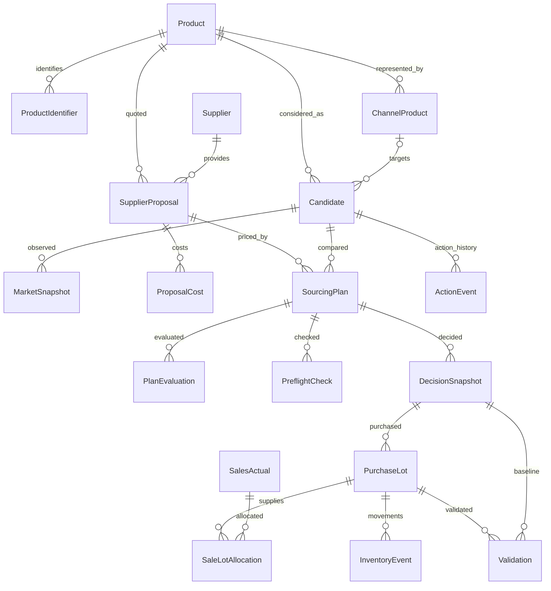

# 物販検証システム：初期調査・仕様レビュー・設計案

調査日：2026-10-01（Asia/Tokyo）  
対象：`xxx-himawari/reselling-business`  
入力：初回開発依頼、および「統合開発仕様書 v1.0」。追加仕様を反映し、初回依頼の金額精度・鮮度・テスト・不変スナップショットの条件も継続する。

本書は設計提案であり、アプリ・DB・APIはまだ実装していない。推奨構成も未導入。初回依頼に従い、今回は現状確認と設計・計画までを行う。

## 結論

最初に作るべきものは、**手動登録でも「候補→数量別試算→最新確認→人間判断→購入→販売→検証」を完結できる小さなアプリ**である。商品探索の自動化より先に、金額計算・予測保存・実績記録を完成させる。

推奨は単一アプリの Next.js / TypeScript と PostgreSQL。Candidateを操作の中心、Productを商品識別の中心に置き、Amazon固有情報はChannelProductとアダプターに分ける。外部API契約・認証は開発開始の条件にしない。MVPの季節性、最大損失、Goal、Validationは残す。

短期目標の30,000円・2026-12-31は**編集可能な初期設定例**であり、計算式・判定コード・テスト条件に埋め込まない。予算、最大損失、同時テスト上限は未指定なので、実購入判定までにユーザーが入力する。未設定を無制限と解釈しない。

## A. 現状確認

GitHubプラグイン経由でリポジトリ情報、ルートcontents、branchesを確認した。

| 対象 | 確認結果 |
|---|---|
| リポジトリ | 存在。公開。アーカイブされていない |
| ファイル | contents APIが `This repository is empty.` を返す |
| ブランチ | branches APIは空配列。default_branch設定はmainだが、調査時点で実在ブランチ・コミットなし |
| 技術スタック・構造 | 未構築。package.json、アプリコード、CIなし |
| 既存機能・DB・マイグレーション | なし |
| 認証 | アプリ認証なし。GitHub接続ではpush権限を確認 |
| 外部API | リポジトリに連携実装なし。Keepa契約やAmazon販売者アカウントの実際の準備状況は未確認 |
| 再利用できるコード | なし。既存コードの全面書き換えは発生しない |
| ローカル | このチャットの作業場所にはwork/とoutputs/のみ。Git checkoutなし |

構成はこれから選べる状態。空リポジトリという回答は権限不足による推測ではなく、API応答で確認した事実。

## B. 仕様レビュー：実装前に直すべき点

全体思想に重大な技術的矛盾はない。一方、次の未定義部分は実績比較を壊すため、実装前に扱いを定める。

| 問題点 | なぜ問題か | 推奨修正 |
|---|---|---|
| 3シナリオの位置付け | 初回依頼は楽観任意、v1.0は3シナリオ基本 | 最新v1.0に合わせ3枠を持つ。根拠不足時の楽観は未算出。Gateは悲観を優先し、楽観で購入を正当化しない |
| 「需要がほぼない」で除外 | データ不足・欠品・季節外れを需要ゼロと誤認し得る | 欠損はNEEDS_CONFIRMATION。明確な販売不可などのみSKIP。低需要の根拠・期間・閾値を保存し、自動削除しない |
| 市場月販の根拠 | ランキング降下を販売個数と同一視できない。表示月販にも欠損・下限がある | observed指標とestimatedレンジを別保存。根拠のある上限がなければupper=null。推定不能を0で埋めない |
| JAN/EAN照合 | 色・サイズ・セット数・親子ASINで誤照合が生じる | 販売単位とセット数をProductに保持。複数照合候補は人間確認。照合確定前は購入推奨不可 |
| 季節性の判定 | 1年未満や一過性の価格変動から季節性を断定できない | seasonalはtrue/false/null。履歴カバー率、需要代理指標、比較期間を保存。前年比は比較可能な履歴がある場合のみ |
| 60〜90日前の発見 | 目安と実際の納期が一致しない | 設定可能な探索期間と、仕入＋納品＋準備＋余裕日数による逆算を両方保持。イベント開始・終了日は手動補完可 |
| Buy Box×Amazon×競合係数 | 同じ影響を重複計上する。係数は確率の保証ではない | 係数に根拠・版・レンジを持ち、重複する項は併用しない。自分月販は市場と独立保存。補正は手動・版管理から開始 |
| 数量別送料・MOQ | 送料が見積数量で変わる。MOQ以外に発注単位や価格段階もある | 見積適用数量範囲、order_multiple、価格帯、送料条件、有効期限を保持。範囲外は再見積 |
| 任意費用のnull | 不明と0円を同一視すると利益が水増しされる | 費用状態をKNOWN / UNKNOWN / NOT_APPLICABLEに分ける。任意入力でも主要費用UNKNOWNなら購入Gateを通さない |
| 「最大損失」 | 回収可能額を楽観的に置くと最大の意味を失う | 有限の保有期間・処分費・回収額根拠を明示。回収額不明は0で保守試算。「設定したストレス条件での推定損失」と表示 |
| 商品単位の損失上限 | 同一商品に複数ロットを買うと、各プランが上限内でも累積超過する | 未決済ロット・承認済み未購入分の残存損失リスクをProduct単位で合算。予算と同時テストも全体でGate評価 |
| 最大仕入価格・損益分岐 | 手数料、送料、数量段階が非線形。単一の引算ではGate全部を満たさない | 現数量・送料条件・悲観価格・利益条件・予算・損失上限を固定して計算。該当する仕入単価なしはnullと理由を返す |
| 月間利益と小ロット | 3個在庫しかないのに月販10個×利益を表示すると過大 | 市場、自分の潜在月販、当該ロットの期間内販売数量を分ける。月利益は在庫と残存販売日数で上限を設ける |
| 利益の定義 | 売れた分の利益、在庫損失、共通固定費を混ぜると目標達成を誤表示 | 商品限界利益と事業利益を分ける。確定事業利益＝実現した販売利益−確定処分損失−期間費用。未確定手数料分は暫定 |
| 資金回収と売切日数 | 売れた日と入金日は異なる。年率ROIは小ロットで過大に見える | 入金遅延設定を用意。回収日数は累積入金で初期支出を回収する時点。売切と分離。ROIは参考値、不能時null |
| 最新データ確認 | fetched_atが新しくても元データが古い場合がある | fetched_atとobserved_atを分ける。発注前確認に有効期限・参照版・人間確認を持たせ、条件変更で失効 |
| 人間が数量変更 | 5個予測を3個購入に直接比較すると評価が歪む | システム推奨と人間の最終数量を両方固定保存。最終数量で再計算した予測を実績比較の主基準にする |
| 在庫途中の実績 | 途中の黒字や月販を最終結果と断定できない | 観測期間、販売可能日数、未売在庫、未確定費用を保存。売切日数は未完了ならnull。Validationは暫定/完了を分離 |
| 売切＝全販売とは限らない | 不良、廃棄、返品がある。利益と在庫が不整合になる | 売切と在庫解消を分ける。在庫台帳に入荷・販売・返品再入庫・廃棄を記録。返品でロットを再開可能にする |
| Amazonの販売実績 | 注文だけでは返品、後日確定費用、保管料が揃わない | 手動/CSVを先行。後にOrders・Finances・Reportsなどを照合。二重計上を防ぐ外部IDと訂正履歴を設ける |
| eBay手動実績 | 国内円だけを前提にすると外貨販売を正しく記録できない | 初期は円換算済み実績と元通貨・元金額・換算日時/根拠を保持。自動FX/APIは後回し。チャネル別KPIを分ける |
| 次の行動の履歴 | current next_actionの上書きだけでは人間の行動を学べない | Candidateに現在の1件、ActionEventに変更・交渉・値下げ等の履歴。SKIPにも「見送り」を設定 |
| 公開リポジトリと業務データ | APIキーや実仕入価格・個人情報を誤ってコミットし得る | GitHubはコードと設計資料の保存先。実績DB、認証情報、顧客情報はコミットしない。ダミーデータのみfixture化 |

### Amazon / Keepaの接続上の確認

- Keepaの表示月販はAmazonの「一定数以上」の観測値で、欠損もある。ランキングなどの代理指標と、推定結果を別扱いする。親子・バリエーション単位も確認する。[公式Product Object](https://keepa.com/api-docs/product-object.html)
- Keepaの履歴取得にはリクエスト設定とトークン消費の管理が必要。発注前確認にキャッシュだけを使わず、元データの更新時刻を検査する。実接続時は現行契約条件・仕様を再確認する。[公式Product Request](https://keepa.com/api-docs/product.html)
- SP-APIは開発者登録、販売者の認可、必要ロールなどの準備が必要。GitHubの接続権限とは別である。[公式Onboarding](https://developer-docs.amazon.com/sp-api/docs/onboarding-overview)
- Product Fees APIの値は見積で、実費保証ではない。保管・広告・返品・処分等をすべて取得できる前提にしない。手動見積と後日の実費照合が必要。[公式Product Fees](https://developer-docs.amazon/sp-api/lang-en_EN/docs/product-fees-api)
- 出品制限は販売者・商品・状態などを考慮して確認する。APIによる制限チェックと、実際に販売できることの最終確認を分ける。[公式Listings Restrictions](https://developer-docs.amazon/sp-api/docs/listings-restrictions-api)

## C. 推奨アーキテクチャと責任範囲

### 技術構成（提案）

| 層 | 推奨 | 責任 |
|---|---|---|
| frontend | Next.js App Router / React / TypeScript | 5画面、入力、根拠・警告・レンジ表示。重要金額の再計算はしない |
| backend | 同じNext.jsのサーバー処理・Route Handlers | 入力検証、認証、use case呼出し、トランザクション。別サーバーは作らない |
| domain | TypeScriptの純粋関数 + Decimal | 着地原価、シナリオ、利益、損失、数量、Gate、Goal差分、検証。HTTP/DB/React依存なし |
| application | サーバーサービス | データ取得の調整、評価、発注前確認、不変判断の保存、実績照合 |
| database | PostgreSQL + Prisma | FK・制約・履歴・トランザクション。金額はNUMERIC、APIでは文字列 |
| adapters | Keepa / Amazon Channel / manual | 外部形式を正規化。チャネル手数料と出品条件を共通ドメインから分離 |
| jobs | 同一コードの手動実行・CLIから開始 | 更新、再計算、CSV取込。将来のみ定期実行。Redis/専用キューは初期不要 |
| tests | Vitest、最低限の画面E2E | 金額の回帰、境界、発注Gate、予測不変、販売から検証まで |

金額の計算はPrisma Decimal等の適切なDecimalで行う。JPY決済金額は円へ丸めるが、数量按分原価は小数を保持。丸め方・段階を版管理し、配賦端数は最後の単位に割り当て総額を一致させる。割合もDecimal。JSONでは金額を文字列にする。[Prismaの型](https://www.prisma.io/docs/orm/prisma-client/special-fields-and-types)

単一ユーザーのローカル運用で開始する案。公開運用する場合は、アクセス制御を先に導入し、サーバー側全APIで認証する。MVPのために独自パスワード認証は作らない。環境変数のAPIキーはサーバー専用。SQLバックアップ/復元と業務データのCSV出力は実販売開始前に用意する。

推奨ディレクトリ（まだ作成していない）：

```text
src/
  app/                    # UIと薄いAPI入口
  domain/                 # money, costing, evaluation, gates, goals, validation
  application/            # use casesとtransaction調整
  adapters/               # keepa/{fixture,http}, amazon, manual
  infrastructure/         # Prisma repository、外部通信、認証
  jobs/                   # 更新・取込用の手動CLI
prisma/                   # schemaとmigration
fixtures/                 # 人工データのみ
tests/                    # domain/integration/e2e
docs/                     # 仕様・設計・運用
```

### API境界

| 操作例 | applicationの責任 | domain / adapterの責任 |
|---|---|---|
| `POST /api/candidates` | Product・ChannelProductの照合と候補登録、重複防止 | 照合はadapter/人間確認。外部入力を無条件で確定しない |
| `POST /api/supplier-proposals` | 見積版、適用数量、出典、日時を保存 | 費用・数量の検証 |
| `POST /api/candidates/:id/market-refresh` | 更新要求、FetchAttempt、成功スナップショットを保存 | KeepaFixture/HTTP→正規化MarketInput |
| `POST /api/sourcing-plans/:id/evaluations` | 参照版とGoal設定を集めEvaluation保存 | 共通原価・数量、AmazonChannelAdapter費用→3シナリオ・Gate |
| `POST /api/sourcing-plans/:id/preflight` | 価格・Amazon本体・仕入価格・在庫・制限の確認、再評価 | TTL、参照版、一致条件の検査 |
| `POST /api/decisions` | 人間判断、数量再計算、予算予約、不変snapshotを同一transactionで保存 | final_quantityでGateを再実行 |
| `POST /api/purchase-lots` | 人間による外部発注の記録。発注APIではない | 数量・実費検証。過去の外部購入はretroactiveとして区別 |
| `POST /api/sales-actuals` | 手動/CSV販売、費用、在庫配賦、訂正、重複防止 | 実利益と原価配賦 |
| `POST /api/validations` | 観測期間と最新実績を確定して版保存 | Prediction vs Actualの誤差と理由 |
| `GET/PATCH /api/goals/:id` | 設定保存・版管理、実現/見込/予定の集計 | 差分、期間切り出し、ボトルネック |

GETは副作用なし。書込APIはschema検証、サーバー認証、idempotency_key、versionによる競合制御を用意する。400入力不正、409参照版不一致、422Gate未通過を区別。外部障害でも過去の成功データを読むAPIは動く。

KeepaAdapterは市場情報の正規化のみ。AmazonChannelAdapterは販売費見積・制限情報の解釈を担当。注文や利益の共通責任をadapterに集めない。ExternalTrendAdapterは将来の追加箇所として記述するだけで、空の実装群は作らない。

## D. DB案

### 共通の保存規則

- 主キーはUUID。ASIN・JAN・eBay IDは外部識別子。
- 金額はNUMERIC(20,6)、通貨コードと税区分（inclusive/exclusive/unknown）を添える。計算前に税の扱いを揃え、unknownは警告。MVPの主要試算はJPY、実績の他通貨は明示換算。
- 日時はUTCのtimestamptz、目標と日次集計はAsia/Tokyo。年内期限は現地2026-12-31を含む排他的終了境界に変換する。
- provenanceにはsource、fetched_at、observed_at、calculation_method、confidence、logic_version。confidenceはLOW/MEDIUM/HIGH/UNKNOWNと根拠を持ち、確率とは表現しない。
- 通常業務列・FKは型付き。JSONBは版付き予測・根拠・チャネル拡張・履歴payloadに限定する。検索の中心を巨大JSONにしない。
- 取得元レスポンスを業務ロジックへ直接渡さない。保存量・利用条件を確認し、必要分のraw payloadを制限保存する。

### 主要テーブル

| テーブル | 主なカラム | 関係・役割 |
|---|---|---|
| Product | id, name, brand, manufacturer, category, variant, pack_quantity, dimensions, weight, image_url | 色・サイズ・セット数を含む販売単位。全チャネルの共通識別 |
| ProductIdentifier | id, product_id, type, value, source, verified_at | JAN/EAN等を複数保持。文字列、先頭ゼロ保持。同一識別子の曖昧照合は確認対象 |
| ChannelProduct | id, product_id, sales_channel, marketplace, external_product_id, condition, match_status, match_evidence | Amazon JPはASIN。channel+marketplace+external_id+conditionを一意にする |
| Candidate | id, product_id, channel_product_id nullable, route, active, recommendation, next_action, next_action_due_at, preferred_plan_id nullable, version | 市場・仕入・行動・実績への操作中心。未照合Route Aも登録可 |
| MarketSnapshot | id, candidate_id, channel_product_id, source, fetched_at, observed_at, demand_lower, demand_upper nullable, demand_period, confidence, basis, calculation_method, logic_version, tags, seasonality, normalized_history | append-only。需要観測値と推定値を分ける。Amazon価格・ランキング・本体・Buy Box等は版付きchannel_metricsに隔離 |
| Supplier | id, name, type, country, url, notes | NETSEA等の分類、手動先。認証情報を入れない |
| SupplierProposal | id, supplier_id, product_id, supplier_product_code, currency, tax_basis, unit_cost, moq, order_multiple, quantity_min/max, stock nullable, lead_time_days, return_terms, defect_terms, direct_ship_allowed, fetched_at, observed_at, valid_until, source, confidence, revision | 見積条件は改版して保存。過去の見積を上書きしない |
| ProposalCost | id, proposal_id, type, amount nullable, currency, tax_basis, cost_state, charge_basis, applicable_quantity, source | 国内/国際送料、関税、輸入税、決済、FX、通関、検品、その他を種類別。charge_basisはper_unit/per_order |
| SourcingPlan | id, candidate_id, supplier_proposal_id, quantity, fulfillment_method, target_sale_start, holding_horizon_days, revision | 商品×仕入先×数量。条件・数量変更は改版。数量とMOQ/発注単位を検査 |
| PlanEvaluation | id, sourcing_plan_id, market_snapshot_id, proposal_revision, settings_version, scenarios, quantity_range, recommended_quantity, gates, reason_codes, confidence, inputs, calculated_at, logic_version | 計算履歴。3シナリオと全主要出力を型検証済みJSONで保持 |
| PreflightCheck | id, plan_id, evaluation_id, references, checked_by, checked_at, expires_at, status, evidence | 最新確認の証拠と適用条件。実データとfixtureを区別 |
| DecisionSnapshot | id, plan_id, evaluation_id, preflight_id nullable, market_snapshot_id, predicted_values, system_recommendation, human_decision, recommended_quantity, final_quantity, override_reason, reason_codes, confidence, data_timestamps, inputs, dimensions, settings_version, logic_version, schema_version, decided_at | append-only。参照だけでなく値・根拠も固定。削除/更新不可、訂正は新規record+supersedes_id |
| Goal | id, target_profit, currency, period_start, period_end_exclusive, timezone, profit_basis, sourcing_budget, max_loss_per_product, max_concurrent_tests, settings_version | 設定はGoalに同居しBusinessSettings別テーブルは初期不要。変更前の設定をsnapshotへ固定 |
| PurchaseLot | id, plan_id, decision_snapshot_id, supplier_id, product_id, order_type, ordered_quantity, received_quantity, actual_unit_cost, actual_shipping, actual_other_cost, actual_landed_total, ordered_at, received_at, defect_quantity, status | decisionに紐づく実購入。仕入はチャネル共通。未入荷と入荷済みを区別 |
| SalesActual | id, product_id, sales_channel, channel_product_id nullable, external_transaction_id nullable, idempotency_key, quantity, unit_sale_price, marketplace_fee_total, fulfillment_fee_total, shipping_cost_total, ad_cost_total, return_loss_total, other_cost_total, allocated_cogs, actual_profit, sold_at, fee_status, original_currency/amount, fx_rate/source/time | 売価は単価、費用は取引総額と命名で区別。販売チャネル必須、実費未確定なら暫定 |
| SaleLotAllocation | sale_id, purchase_lot_id, quantity, allocated_cogs | 販売と仕入ロットを結ぶ。同じ在庫を複数チャネルで販売可能。MVPは一販売一ロットで入力、将来複数配賦可 |
| InventoryEvent | id, purchase_lot_id, sales_actual_id nullable, type, quantity_delta, cost_amount, occurred_at, reference_id | 入荷・販売・返品・不良・廃棄の台帳。非販売損失も記録 |
| PeriodExpense | id, goal_id nullable, amount, currency, type, occurred_at, source, finalized | Keepa等の共通費用。商品利益に含まれる費用の二重計上を禁止 |
| Validation | id, decision_snapshot_id, purchase_lot_id, period_start/end, available_days, predicted, actual, errors, reason_codes, notes, status, sample_size, evaluated_at, logic_version, revision | 比較単位はロット×期間。実績修正は新しい検証版を追加 |
| ActionEvent | id, candidate_id, plan_id nullable, purchase_lot_id nullable, action_type, before/after, reason, actor, occurred_at | 交渉、発注、数量変更、値下げ、損切り等の履歴 |
| FetchAttempt | id, adapter, candidate_id, attempted_at, status, error_code/message, last_successful_fetch_at, snapshot_id nullable | 障害を成功データと分離。失敗で過去snapshotを消さない |

### 関係



Goalは設定版を通じて評価・判断に関係する。EBAYのChannelProductは将来のlisting単位・再出品に対応できる1:Nを保持し、ASINのような安定したカタログIDを要求しない。MVPのeBay手動実績はchannel_product_idなしでも記録できるが、Amazon評価への比較を自動で流用しない。

### 制約と不変条件

- Candidate.product_id、ChannelProduct.product_id、Proposal.product_id、Lot.product_id、SalesActual.product_idの整合をサービスとDBで検査。選択推奨プランは同じCandidateに属する。
- 数量は正の整数。lower≤upper（upper不明は許容）。費用不明は0に置換しない。比例係数の有効範囲を検査する。
- アクティブCandidateはnext_action必須。推薦と次の行動は別フィールド。
- DecisionSnapshot・MarketSnapshot・評価は不変。業務FKの連鎖削除を禁止し、参照データは無効化で扱う。
- SKU/外部取引ID・idempotency_keyでCSV/API重複を防ぐ。在庫数超過の販売を同一transactionで拒否。
- 予算予約・同時テスト枠の消費は同一transactionで行う。別画面から同時承認しても上限を越えない。
- 最終人間判断がBUYでも、stale・未照合・未確認制限・未設定リスク上限をoverrideだけで購入可能にしない。外部で既に実施した購入は例外記録として残し、通常承認扱いにしない。

## E. 計算・Gate・検証の設計

### 重要計算は一箇所に置く

1. 着地総原価＝数量×単価＋単位費用×数量＋注文単位費用。海外費用はMVPでは明示JPY換算済みの値を受け取る。着地単価＝総原価÷数量。
2. 単位利益＝単位売上−着地単価−販売あたりの費用−明示した固定費配賦。原価と販売費の納品費を重複させない。
3. 自分の月販レンジは需要と獲得率レンジから算出。標準/悲観/楽観の数量仮定を保存し、独立した不確実性を単純に保証確率として扱わない。
4. 当該ロットの月利益＝期間内販売見込数量×単位貢献利益−期間/ロット固定費。見込数量は需要、売れる在庫、販売開始日、季節終了、目標期限で制限する。固定費は一度だけ控除。
5. 必要資金＝商品・送料等の先払い＋販売開始前の費用＋設定した必要運転資金。既存の予算予約・在庫拘束資金を差し引いて残額を判定。
6. 最大損失＝全仕入資金＋準備＋保有期間の保管＋処分−回収可能純額。項目明細、期間、回収根拠をsnapshotに固定。
7. 損益分岐価格は純利益=0となる価格。販売費が段階的に変わる場合は整数通貨単位で探索し、解なしを返せる構造。最大仕入単価も条件付きで求め、Gate全体を再実行する。
8. 売切日数は販売可能数量÷自分月販からレンジ算出。月販下限0の場合、上限日数は算出不能。回収は入金遅延を含む別計算。年率ROIは回収日数・必要資金が正で根拠がある場合のみ参考表示。
9. 推奨数量はMOQ/発注単位を満たす少数の候補数量を再評価し、予算・損失・販売期間を通過した範囲から最小テストを優先。適格数量なしの場合は0個購入と理由を返す。最適化エンジンは作らない。
10. Goal確定差分=max(0,目標−確定事業利益)。販売中見込み・予定テストは別表示。見込み込みの不足レンジは参考欄に分離し、達成表示は確定利益だけで決める。同一候補の代替プランを合算しない。

### Gateと推薦

判定の順序：販売可能性/照合→データ鮮度・必須費用→数量/MOQ/在庫→予算/同時テスト/商品累積損失→悲観利益/期間。

- `NEEDS_CONFIRMATION`：鮮度不足、費用不明、照合未確定、出品制限未確認等。
- `WAIT_CONDITION`：仕入単価、数量、予算、在庫、開始時期など、改善可能な条件を明記。
- `TEST_NOW`：Gate通過、実績不足。次の行動は人間の少量テスト判断。
- `BUY_OR_REPLENISH`：自分の該当条件の実績を確認し、現在のGateも通過。市場データだけで追加仕入れにしない。
- `SKIP`：明確な販売不可、または根拠付き人間見送り。候補を削除しない。

Gate通過プランのみ悲観月利益/必要資金で整列。必要資金が0/不明なら比率nullで末尾、同値は悲観利益などで明示的に並べる。全候補の総合点に変換しない。複数のボトルネックとその根拠を表示できるが、アクティブCandidateのnext_actionは常に1つ。

### 発注直前の確認

手動でも、最新Buy Box、Amazon本体、仕入価格、仕入在庫、出品可否の確認日時と出典を残す。fixtureは開発専用で、実購入承認の根拠に使用不可。

再評価→人間の最終数量→最終数量で再評価→Preflightに参照版を結び付け→DecisionSnapshotを保存。TTL超過、数量/送料/価格/設定の変更、取得失敗時は承認を失効させる。設定TTLは実商品検証時に決める。手動確認にはその限界と担当者を保存する。

システムは外部仕入先への注文を送らない。PurchaseLotは人間が行った発注の記録。承認後に条件が変わった場合は改めて確認・判断する。既に外部発注した取引の後追い登録は欠落事実を隠さず保存する。

### Prediction vs Actual

比較は同じロット・数量・チャネル・期間で行う。自分の販売可能期間の販売速度と、市場全体の月販誤差は別で、市場全体の実測がない場合は検証不能と表示する。

レンジ誤差は実績が下限未満/範囲内/上限超えかと範囲からの距離を保存。単一値の誤差は実績−予測。割合の分母が0ならnull。月販換算はavailable_days>0の時だけ行い、観測日数を併記する。欠品時の販売数を需要減と断定しない。

売切前は観測打切り、返品や処分による在庫解消も別表示。損失超過は実現したロット損失と固定した推定損失を比較し、未確定費用があれば暫定扱い。

理由コードは初回仕様のDEMAND_OVER_ESTIMATE、SEASONALITY_ERROR、COMPETITION_CHANGE、AMAZON_ENTRY、UNIT_COST_ERROR、SHIPPING_COST_ERROR、LEAD_TIME_ERROR、DEFECT_RATE_ERROR、OWN_SALES_OVER_ESTIMATE、BUYBOX_SHARE_ERROR、RETURN_RATE_ERROR、FEE_ERROR、PRICE_DROP、QUANTITY_TOO_HIGH/LOW、HUMAN_OVERRIDEを使用。原因未確定はUNKNOWNと自由記述を残し、システムが因果を断定しない。

KPIは5つまで。黒字率は完了テスト数を分母にし、件数を表示。利益比率は同期間の実利益/予測利益（予測0以下なら未算出）。チャネル別と全体を区別。データが少ない段階では必要商品数・勝ちパターンを断定しない。

## F. 実装計画

初回指定のPhase 0〜7を維持する。ただし実販売前にPhase 6の記録機能を必ず完成させ、API全面接続を待たずに手動の実商品検証へ進む。

| Phase | 実装内容 | 完了条件 | 依存 | テスト | 外部API |
|---|---|---|---|---|---|
| 0：今回 | 現状調査、仕様レビュー、構成/DB/API/計画 | 本書とv1.0を保存。未確定事項を明示 | なし | API応答・資料整合確認。アプリテスト対象なし | GitHub/公式資料のみ |
| 1：基盤 | 単一アプリ、DB、Product/Candidate/Supplier/Proposal/Plan/Goal、金額型 | 両入口を手動登録。数量・参照整合、設定変更、再起動後保持 | 0 | FK・重複・MOQ・Decimal往復・migration | 不要 |
| 2：市場 | KeepaAdapter fixture、正規化snapshot、需要タグ、季節性 | 需要レンジと根拠、不明季節性、履歴/日時、障害時の最終成功データ表示 | 1 | 欠損・親ASIN・時刻・外れ値・履歴不足・季節境界 | fixture、実API不要 |
| 3：原価 | 手動見積、費用状態、数量条件、着地原価 | 数量変更で送料・単価条件を再検査。按分総額一致 | 1 | 国内/海外の換算済み費用・MOQ・送料境界・端数 | 不要 |
| 4：判定 | Amazon費用見積の手動設定、3シナリオ、利益/損失/最大単価/数量/Gate | すべての主要出力に値または未算出理由。根拠と版保存 | 2,3 | 指定金額計算の回帰、ゼロ販売・赤字・解なし・累積リスク | 不要 |
| 5：行動UI | Candidate List/Detail、Action Queue、Goal、確認フロー | 1候補1行動、Gate後整列、Goalの確定/見込/予定分離 | 4 | 並び順、期限・確定差分、未設定上限、鮮度失効 | 不要 |
| 6：販売検証 | 不変Decision、PurchaseLot、SalesActual、返品/廃棄/期間費用、Validation、履歴、バックアップ/出力 | 1件の手動購入から販売・検証まで完結。eBay手動実績も区別して保存 | 4、5の最小UI | 下記の連結テスト、重複・在庫超過・snapshot不変・復元 | 手動/CSVで不要 |
| 7a：Keepa実接続 | 契約確認、少数ASINの更新、トークン制御、fixtureと実データ分離 | 実商品で市場履歴・季節性・鮮度を確認。秘密をサーバーだけに保持 | 2,6（開発は2以後並行可） | response契約・認証失敗・rate limit・再試行 | Keepa必要 |
| 7b：SP-API | 制限・価格・手数料→自分の販売/財務照合の順で追加 | 手動値と比較し差分記録。未取得費用を欠損扱い。取込再実行可能 | 認可準備、4,6 | adapter契約・部分障害・CSV/API重複・後日費用訂正 | SP-API必要 |

### 実販売を開始できるタイミング

**Phase 6の完了後が最初のシステム経由少量テスト開始点。** 手動の実市場情報、最新制限確認、見積、最終数量、予算/損失上限、予測snapshotを揃える。Keepaの自動分析に依存して判断する場合は7a完了も必要。fixtureだけでは実購入Gateを通さない。SP-API全面接続は開始条件にしない。

販売可能アカウント・出品資格、実仕入先、配送準備はシステムの外側の準備事項。未確認なので、アプリ完成を実販売開始の保証とはしない。

### 初回少量テストの完了条件

- 同じProductで2仕入先または2数量のプランを比較できる。
- 最終数量で再計算した悲観利益・資金・損失と根拠を確認できる。
- 再確認が失効した場合は新しい購入承認を作れない。
- 人間が注文し、実原価・販売・実費・返品/不良を記録できる。
- 元の予測が変わらず、観測期間と未売在庫を含めて検証できる。
- Goal達成は確定利益だけで表示し、DBを復元できる。

### 必須自動テスト

1. 着地原価：3個×1,000円＋注文送料500円＝3,500円。単価の丸めで総額を失わない。
2. 単位/月利益：売価、比例手数料、単位費用、固定費を別に適用。在庫3個・月販10個でもロット月利益は3個以内。
3. 最大損失：準備・保管・処分・回収額を含む。回収不明は楽観的に減額しない。同一商品複数ロットの合算。
4. 損益分岐/最大仕入単価：手数料段階、利益0境界、解なし、予算/損失上限併用。
5. 数量変更：送料按分・価格帯・MOQ/倍数、推奨5→最終3の再試算。
6. Goal差分：任意目標、赤字、期限外、JPY日付境界、予定/見込を達成判定へ混ぜない。
7. 予測vs実績：範囲内/外、予測0、観測期間0、未売在庫、返品/処分、暫定費用。
8. 判断保存：最新価格更新後も過去の予測不変。stale/fixture/版違い拒否、override理由、同時承認の予算超過防止。
9. 実績取込：同じCSVを2回読んでも利益と在庫不変。販売数量超過、別商品ロット配賦拒否。
10. 連結テスト：候補→見積→プラン→再確認→人間判断→購入→販売→検証→Goal。

数量変更・販売・返品などの重要計算は、UIの見た目だけのテストに置き換えない。

## G. MVP削減提案

削減するのは探索と自動化の広さであり、実績保存の正確さではない。

| 初期から後回しにするもの | 代替 | 理由 |
|---|---|---|
| NETSEA/orosyの自動収集・API接続 | URL、商品コード、見積の手動登録 | アクセス方式の調査より実際の仕入条件を優先 |
| Keepa Product Finderの独自探索UI・大量照合 | 少数ASIN/JANの手動入力・CSV、既存探索から候補取込 | 最初のテスト商品の比較に集中 |
| SP-API全機能の同時接続 | 制限/価格/費用の手動確認→小さく接続 | 認証準備で全工程を止めない |
| 詳細な季節グラフ大量作成 | 月別代理指標、ピーク/終了日、履歴不足警告、必要な1履歴図 | 季節性は残し、表示コストを絞る |
| 年率ROIの目立つ表示・詳細入金予測 | 根拠のある参考値、回収レンジ | 誤解を避け、損失・期間を優先 |
| 必要商品数の経験則・勝ち負け分析画面 | 件数・実利益・誤差・理由を保存 | 少数データから精度を演出しない |
| eBay分析/API/国際配送自動計算 | 手動出品、円換算済み実績、元通貨と換算根拠 | 販売と記録を先に始められる |
| 多通貨台帳・多ユーザー権限・マイクロサービス | JPY試算、単一ユーザー、単一アプリ | 現在の検証規模に必要ない |

削らない：最大損失、数量再計算、鮮度、発注前確認、不変予測、購入/販売/返品/処分の記録、Goalの分離、季節性の不明扱い、5つのKPI、重要計算の自動テスト。

現在は2026年10月1日。年内利益のため、初期テストは年末までに「仕入・納品・販売・返品や費用確認」を行える期間から逆算する。12月ピークであっても、到着が季節終了後になるプランは条件待ちまたは見送りへ。短期達成のために未知の係数や楽観利益を使って仕入量を増やさない。

## H. 未確定事項と次の開発単位

設計レビューを進めるための仮定は、単一ユーザー・JPY中心・ローカル開始・手動実績先行。これらは変更可能で、今回ユーザーの決定済み条件とは扱わない。

実装を進める際に確認する項目：

- 実際の仕入予算、商品単位損失上限、同時テスト上限。
- Amazon販売者アカウント、FBA/FBM、出品制限確認の準備状況。
- 使用場所がローカルか、外出先からアクセスする公開環境か。
- Goalは商品利益か共通費用控除後の事業利益か。本書は後者を推奨。
- 最初の実商品、仕入先、証拠となる見積・市場履歴の入手方法。

これらを理由に今回の設計作業は止めない。次の開発単位はPhase 1の保存基盤と金額型。最初から全機能を一括実装しない。
